# KTU SA CMS — User Guide

This guide explains how to run the KTU SA website content from the CMS admin panel. It is written for content editors: no programming knowledge is assumed.

The CMS is *headless*. Nothing you do here changes the design of the website — you edit the content, and the public site (built separately in Next.js) reads that content through an API and renders it. The practical consequence is that there is no "preview the page" button inside the CMS. To see your work, open the public website after publishing.

---

## Table of contents

1. [Signing in](#1-signing-in)
2. [Finding your way around](#2-finding-your-way-around)
3. [Concepts you need before editing anything](#3-concepts-you-need-before-editing-anything)
4. [Articles](#4-articles)
5. [Events](#5-events)
6. [FAQ](#6-faq)
7. [Documents](#7-documents)
8. [Contacts, members and positions](#8-contacts-members-and-positions)
9. [General Info — SA units](#9-general-info--sa-units)
10. [Sponsors](#10-sponsors)
11. [Static pages](#11-static-pages)
12. [Activity reports](#12-activity-reports)
13. [Media library](#13-media-library)
14. [Users, roles and permissions](#14-users-roles-and-permissions)
15. [Publishing checklist](#15-publishing-checklist)
16. [Troubleshooting](#16-troubleshooting)
17. [Appendix — the public API](#17-appendix--the-public-api)

---

## 1. Signing in

Open the CMS address in a browser and sign in with the username (or email) and password you were given.

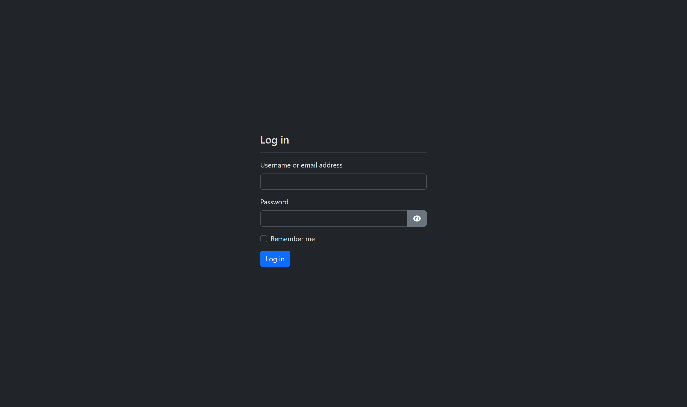

Tick **Remember me** only on a computer that is yours alone. If you forget your password, an administrator has to reset it for you from **Access Control → Users**; there is no self-service reset.

---

## 2. Finding your way around

After signing in you land on the dashboard. The tiles are shortcuts to the sections you will use most; the menu on the left is the full navigation and is always available.

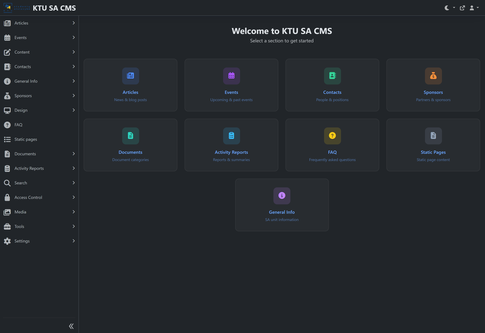

The left menu is grouped by *what you are managing*, not by technical content type:

| Menu | What lives there |
| --- | --- |
| **Articles** | News and blog posts |
| **Events** | Events, including import from Fienta |
| **Content** | The raw Orchard Core content browser — everything, unfiltered |
| **Contacts** | People, main office contacts, and the list of positions |
| **General Info** | The SA units themselves (InfoSA, ESA, …) and their member lists |
| **Sponsors** | Partners and sponsors shown on the home page |
| **FAQ** | The single FAQ page and its questions |
| **Static pages** | Hero titles, descriptions and images for fixed pages |
| **Documents** | Document categories and the PDFs inside them |
| **Activity Reports** | Periodic PDF reports per unit |
| **Media** | The shared file library (images, PDFs) |
| **Access Control** | Users and roles |
| **Design**, **Search**, **Tools**, **Settings** | Administrator-only areas |

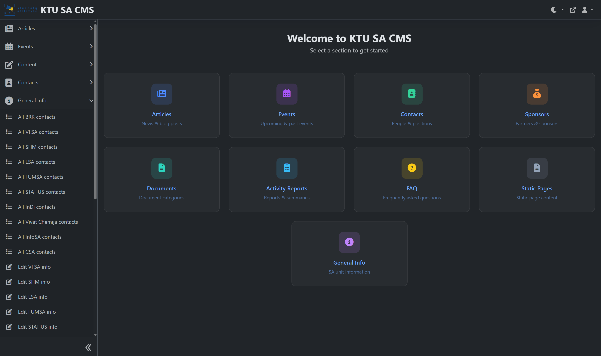

The screenshot above shows **General Info** expanded. Clicking a menu heading with a `>` arrow opens its sub-entries; the `«` button at the very bottom of the menu collapses it to icons only and back again.

You will only see the menu entries your role allows. An InfoSA editor, for example, sees the InfoSA entries under **General Info** and nothing for the other units. If a menu you expect is missing, that is a permissions question — see [section 14](#14-users-roles-and-permissions).

The moon icon in the top-right corner switches the admin theme between **Auto**, **Light** and **Dark**. It is a personal preference and affects nobody else.

---

## 3. Concepts you need before editing anything

Six ideas explain almost everything in this CMS. Read this section once and the rest of the guide becomes mechanical.

### 3.1 Content items

Every piece of content — one article, one event, one sponsor — is a *content item*. Items are listed in tables with a search box and filters above them (latest / owned by me / published / unpublished, and a sort order). Each row shows the Lithuanian and English titles with `lt` and `en` badges, the publication state, when it changed and who changed it, and on the right **Edit**, **View** and an **Actions** menu holding the rest — publish, unpublish, clone, delete.

### 3.2 Draft versus published

Most content types are *draftable*. That gives you two buttons at the bottom of the editor:

- **Save Draft** — stores your changes but leaves the live site untouched. Safe at any time.
- **Publish** — makes the current version the one the public site reads.

A draft of an already-published item does not replace the live version until you publish it, so you can work on a revision over several days without anyone seeing it. The list view shows the state of each item, and an item with unpublished changes is flagged as a draft.

Articles, events, sponsors, documents, FAQ questions and activity reports work this way. Contacts, positions, main contacts, document categories, static pages and SA unit info do **not** — those editors show **Publish** without **Save Draft**, so what you save goes live immediately. Have your text and images ready before you open one of those.

The quickest way to tell which kind you are in: look at the buttons at the bottom of the form before you start typing.

**Unpublish** takes an item off the public site without deleting it. Prefer it over **Delete** when content might come back.

### 3.3 Everything is bilingual

The public site runs in Lithuanian and English. Rather than maintaining two separate content trees, each item carries both languages side by side. You will constantly see field pairs:

- **Title LT** and **Title EN**
- **Body (Lithuanian)** and **Body (English)**
- **Upload Lt version document** and **Upload En version document**

Fill in both. If an English text is genuinely missing, the site generally falls back to the Lithuanian value rather than showing an empty page, but that is a safety net, not a plan.

### 3.4 Parts — why an editor is laid out the way it is

An editor form is assembled from *parts*: the plain fields at the top, then one or more rich content sections. The fields always appear in the same order for a given content type, so once you have edited one article you know where everything is in all of them.

### 3.5 Widgets — how rich content is built

Long-form content is not one big text box. Each **Body** / **Content** section is a stack of *widgets*, added one at a time in the order you want them to appear. A new item starts with a single empty **Paragraph** widget already in place.

To add another, click the blue **+** button with the small arrow at the bottom edge of the section and pick a type:

| Widget | Use it for | Accepted files |
| --- | --- | --- |
| **Paragraph** | Formatted text — bold, italic, links, bulleted and numbered lists | — |
| **Image** | A single standalone image | `.jpg` `.jpeg` `.png` `.webp` |
| **Image Carousel** | Several images the reader can swipe through | `.jpg` `.jpeg` `.png` `.webp` |
| **Video** | An embedded video (paste the YouTube URL) | — |
| **PDF Document** | An inline PDF | `.pdf` |

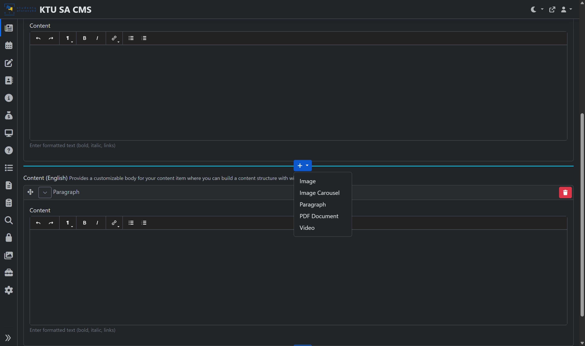

Widgets can be reordered by dragging the cross-arrows handle on the left, collapsed with the chevron next to it, and removed with the red bin button on the right. The same five widgets are available in every rich body across the whole CMS — articles, events, FAQ answers, SA unit pages and static pages.

The Paragraph editor is deliberately restricted: undo/redo, paragraph formatting, bold, italic, link, bulleted list, numbered list. There are no font, colour or size controls, because the public site applies its own typography. If you paste styled text from Word, the styling is dropped — that is intended.

### 3.6 Media fields

Wherever you upload an image or a PDF you get the same control: a **+ Browse** button and, once something is attached, a red bin to detach it. **+ Browse** opens the media library, where you can either pick an existing file or upload a new one. Files uploaded this way live in the shared library and can be reused, so check whether a logo already exists before uploading a second copy of it.

Required media fields are marked with a red `*`; the form refuses to save without them.

---

## 4. Articles

- **Menu:** Articles → All articles / Create an article
- **Public page:** `/lt/articles`, `/en/articles`

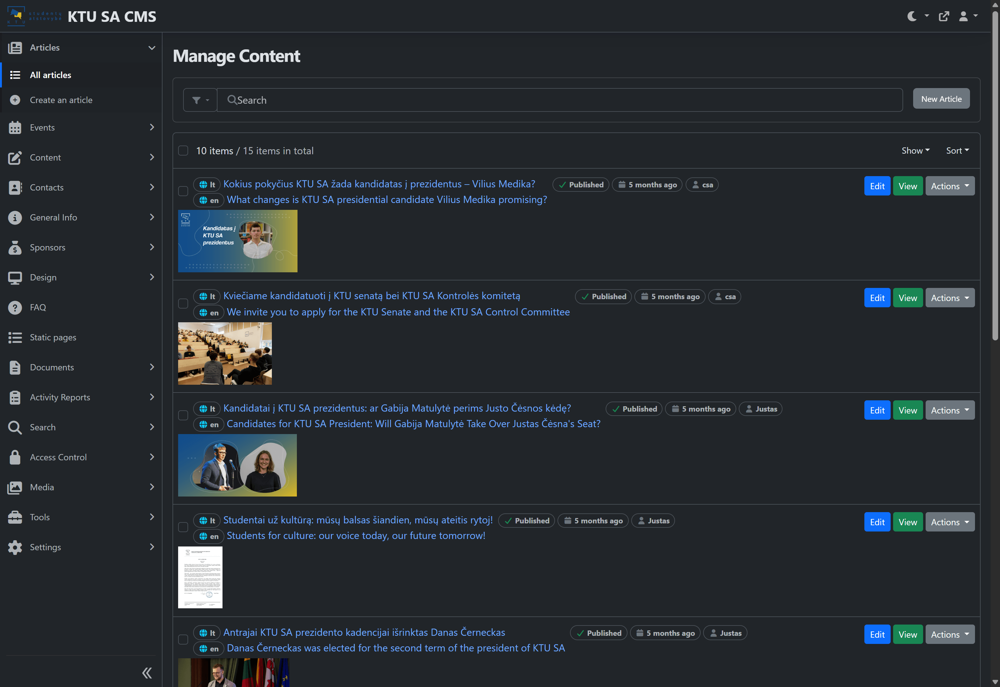

The list is sorted newest first and is paginated. Use the search box at the top to find an article by title.

### Creating an article

Choose **Articles → Create an article**.

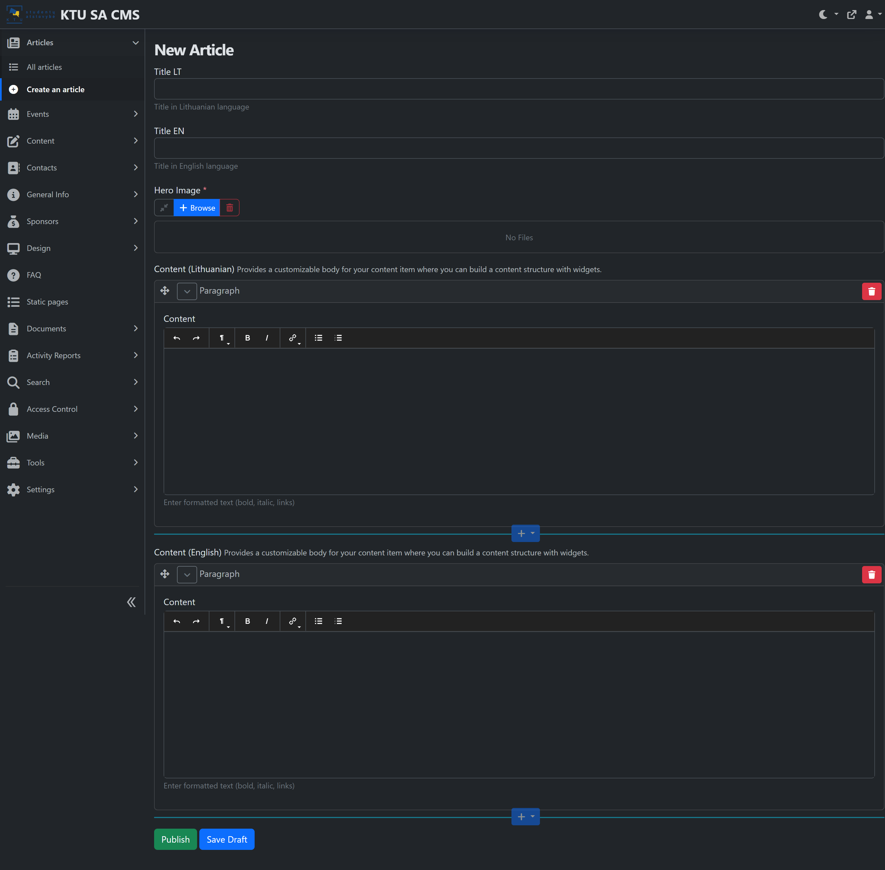

Fill in, from top to bottom:

1. **Title LT** and **Title EN** — the headline, shown on the article card in the listing and at the top of the article page.
2. **Hero Image** — required. A single `.jpg`, `.jpeg`, `.png` or `.webp`. This is the large image at the top of the article and the thumbnail in the listing, so use a wide landscape image; tall portrait images get cropped badly.
3. **Content (Lithuanian)** — build the article body from widgets.
4. **Content (English)** — the same article in English.

Then **Publish**, or **Save Draft** if you are not finished.

### Editing and removing

Open an article from the list and use **Edit**. Save a draft while you work and publish when ready. To take an article off the site but keep it, use **Unpublish**; **Delete** is permanent.

> The article listing on the public site shows the two most recent articles as large featured cards and the rest in a grid, eight per page. Nothing in the CMS controls that — it follows publish order automatically.

---

## 5. Events

- **Menu:** Events → All events / Create an event
- **Public page:** `/lt/events`, `/en/events`

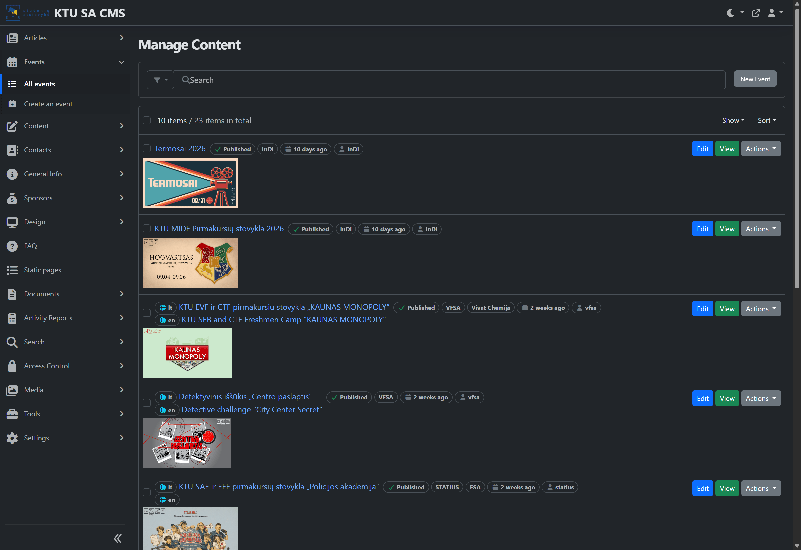

### Creating an event

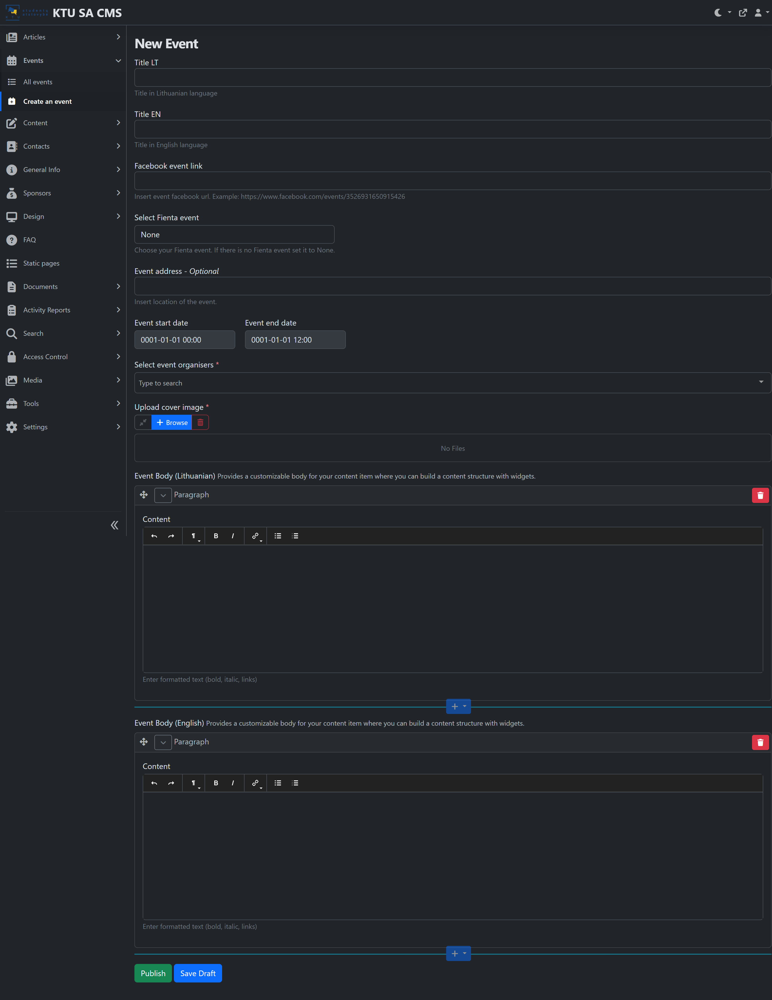

The fields, in the order the form presents them:

| Field | Notes |
| --- | --- |
| **Title LT** / **Title EN** | Event name in both languages |
| **Facebook event link** | Optional. The full Facebook event URL |
| **Select Fienta event** | Ticket link — see below. Leave it on *None* if the event has no ticket sale |
| **Event address** | Optional. Free text venue address |
| **Event start date** / **Event end date** | Both required; the site uses them to split upcoming from past events. They default to `0001-01-01`, so you must set them |
| **Select event organisers** | Required. One or more SA units. This is what makes the event appear on a unit's page |
| **Upload cover image** | Required. `.jpg` `.jpeg` `.png` `.webp` |

Below that, **Event Body (Lithuanian)** and **Event Body (English)** hold the description, built from the same widgets as an article.

**Select event organisers** matters more than it looks: it is the only link between an event and an SA unit. An event with no organiser selected will not appear on any unit page.

### Importing an event from Fienta

If the event is already set up in Fienta, you do not have to retype it.

1. In the **Select Fienta event** dropdown, choose the event. An **Import data from Fienta** button appears beside the dropdown — it stays hidden while the selection is *None*.
2. Click **Import data from Fienta**.
3. Confirm the dialog. It warns that the import will overwrite fields and save a draft.

The import fills in the titles, address, start and end dates, the ticket links for both languages, downloads the Fienta cover image into the media library, and puts the Fienta description into the first Paragraph widget of each body.

Two things to know:

- The import **saves a draft**. Nothing reaches the public site until you review it and press **Publish**.
- It **overwrites** the fields it manages. If you have hand-edited the title or the description, re-importing will replace your edits.

Always review after importing — Fienta descriptions are often written for a ticket page and need trimming — and add the organisers, which Fienta cannot supply.

If the dropdown offers nothing but *None*, the CMS is not seeing any Fienta events. That is a configuration matter (the Fienta organiser ID), not something you can fix from the editor — fill the event in by hand and tell a developer.

---

## 6. FAQ

- **Menu:** FAQ
- **Public page:** `/lt/faq`, `/en/faq`

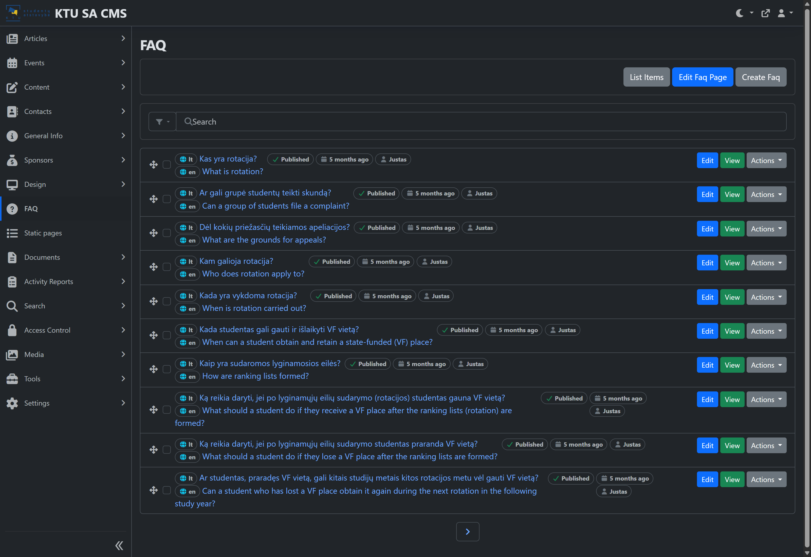

The FAQ works differently from the other sections: there is exactly **one** FAQ page, and the questions live inside it. You cannot create a loose FAQ item from the **Content** menu, and you should not create a second FAQ page.

Clicking **FAQ** in the menu opens that page directly. Along the top you get three buttons — **List Items**, **Edit Faq Page** and **Create Faq** — and below them the questions themselves:

- **Create Faq** — add a new question.
- The cross-arrows handle at the left of each row — drag to reorder. **The order here is the order on the public site**, so put the questions people actually ask at the top.
- **Edit**, **View** and an **Actions** menu per question.

Each row shows the Lithuanian and English question together with an `lt` / `en` badge, so you can see at a glance whether a translation is missing.

A question has four fields:

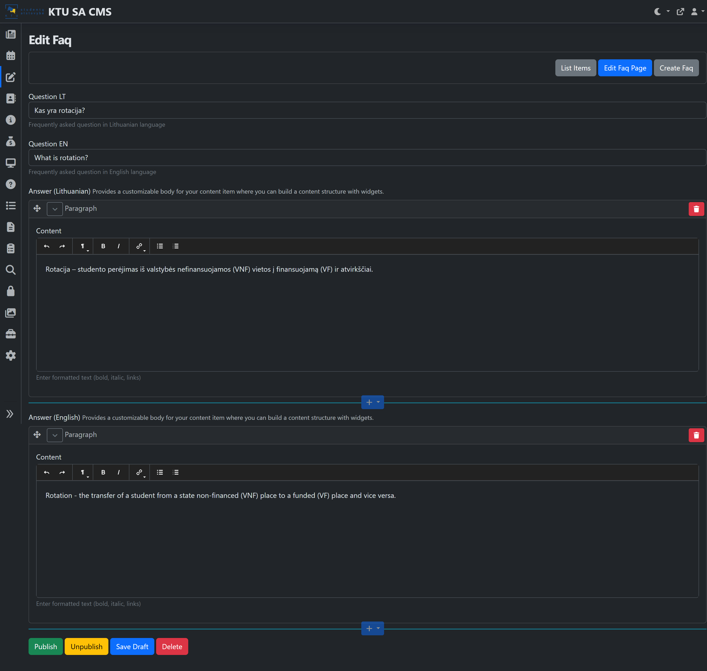

1. **Question LT**
2. **Question EN**
3. **Answer (Lithuanian)** — widgets, so an answer can contain a link, a list, or an attached PDF.
4. **Answer (English)**

Publish the question when you are done. Questions are numbered automatically on the public site; the numbering follows your ordering and continues correctly across pages.

The public FAQ page has a search box that matches both the question and the answer text, and shows ten questions per page.

---

## 7. Documents

- **Menu:** Documents → All Document categories / Create new document category

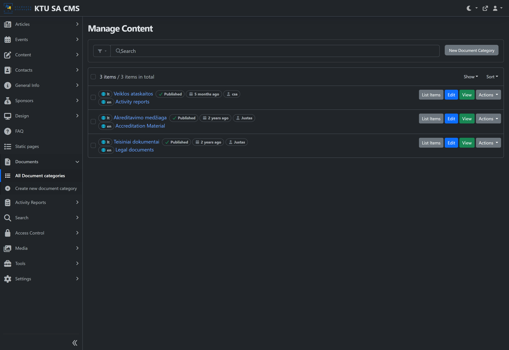

Documents are organised in two levels: a **category** contains **documents**. You create categories from the menu; you create documents *inside* a category, the same way FAQ questions live inside the FAQ page.

### Creating a category

A category needs only **Title LT** and **Title EN**. Save it, then open it to add documents.

### Adding a document to a category

Open a category with **List Items**. Inside you get **Edit Document Category** (rename the category) and **Create Document** (add a PDF to it).

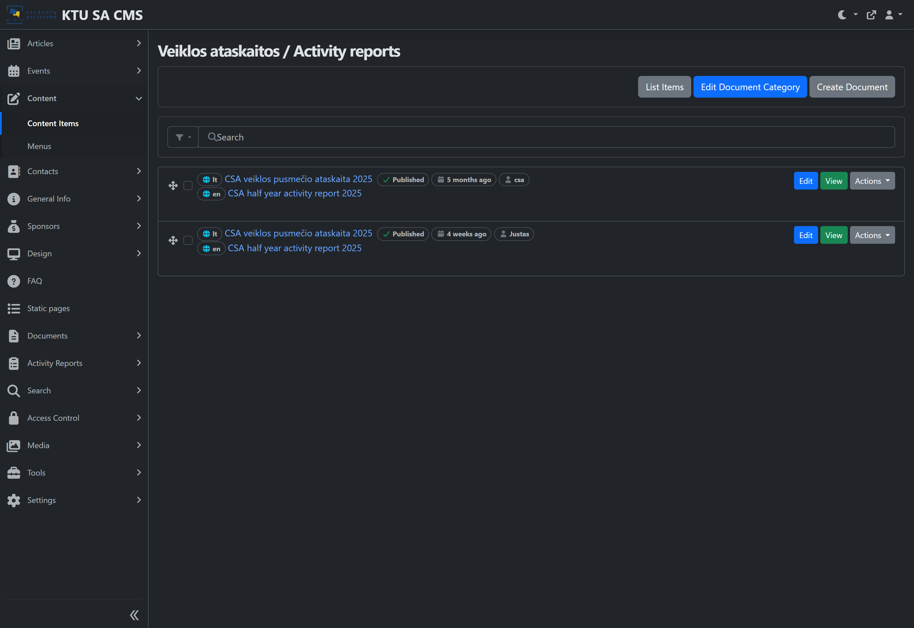

Each document needs:

- **Title LT** and **Title EN**
- **Upload Lt version document** — a `.pdf`, required
- **Upload En version document** — a `.pdf`, required

Both PDFs are mandatory. If you genuinely have only one language version, upload the same file twice rather than leaving the field empty, otherwise the item will not save.

Documents inside a category can be dragged into the order you want. On the public site each document opens in a preview dialog rather than downloading immediately.

Watch for accidental duplicates: two documents with the same title in one category will both appear on the public site. If you see the same title listed twice, one of them is a stray copy — delete it rather than leaving both published.

---

## 8. Contacts, members and positions

- **Menu:** Contacts → All contacts / Main contacts / All positions

This section covers three related but separate things. Getting them straight saves confusion:

- **Positions** — the *job titles*. "President", "Marketing coordinator". Created once, reused by everybody who holds that title.
- **Contacts** — the *people*. Each person points at one position and one SA unit.
- **Main contacts** — the *office* contact block for a unit: address, phone, email. One per unit, not a person.

### Positions

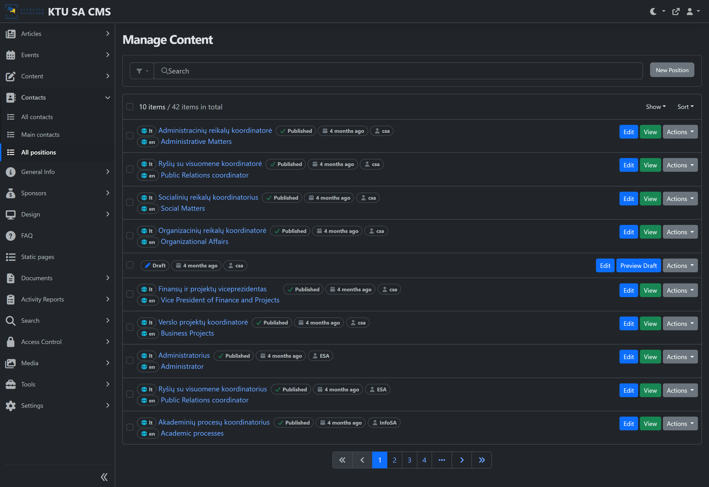

A position has **Position name LT**, **Position name EN**, **Description LT** and **Description EN**. The description is the short explanation of what the role is responsible for, shown next to the person on the public contacts page.

Create the position **before** the person who holds it — you cannot save a contact without picking one.

### Contacts (people)

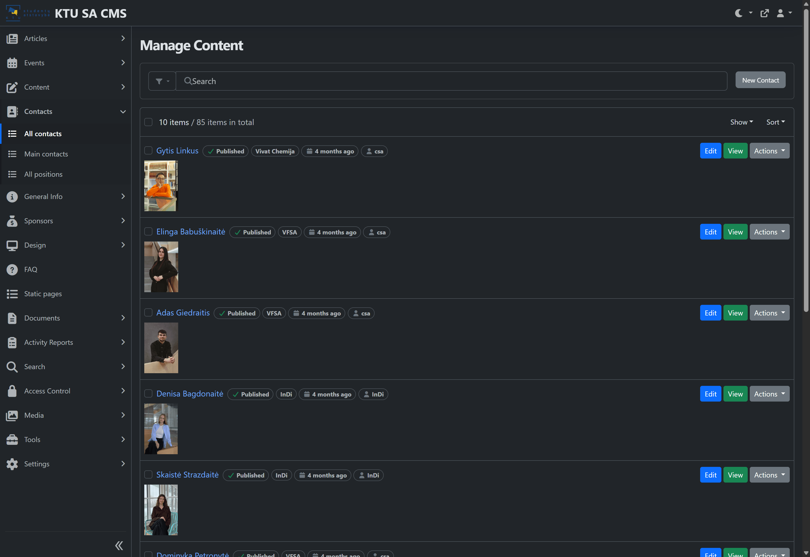

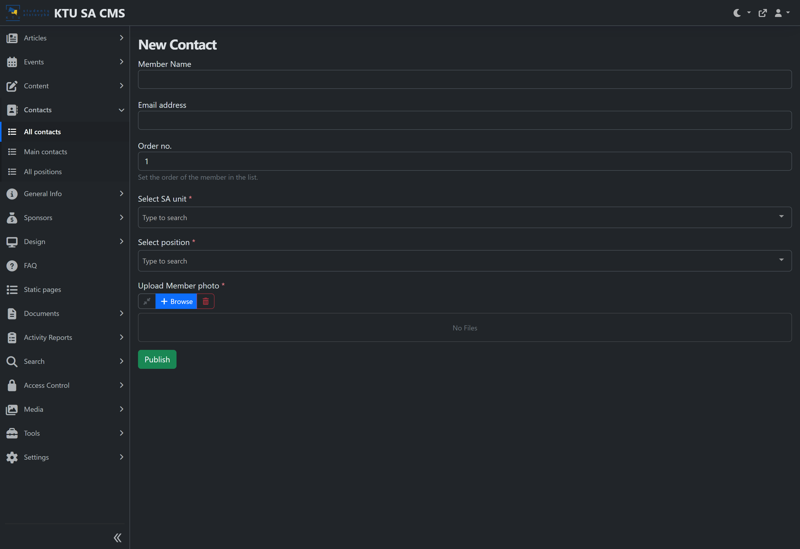

| Field | Notes |
| --- | --- |
| **Member Name** | Full name |
| **Email address** | Work email |
| **Order no.** | Sort order within the unit. Lower numbers first — use it to put the president at the top |
| **Select SA unit** | Required. Which unit this person belongs to |
| **Select position** | Required. Pick from the positions you created |
| **Upload Member photo** | Required. `.jpg` `.jpeg` `.png` `.webp` |

Use **Order no.** deliberately. If every person has the same number, the order on the public page is arbitrary and will look random.

Contacts are not draftable — the editor offers **Publish**, not **Save Draft**. Have the photo and details ready before you start.

When the academic year changes, the usual job is: edit each existing contact and replace the name, email and photo, keeping the position. That preserves the ordering you set up.

### Main contacts

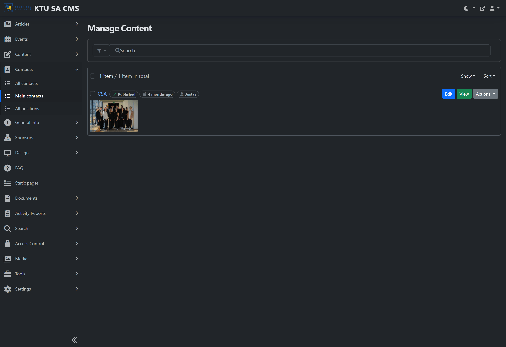

One entry per SA unit, holding **Phone Number**, **Email address**, **Upload Contact photo** and **Address**. These are not created and deleted in normal use — you edit the existing entries, and the editor offers **Publish** and **Unpublish** only.

The CSA main contact is the one used in the site footer, so an error there is visible on every page.

---

## 9. General Info — SA units

- **Menu:** General Info

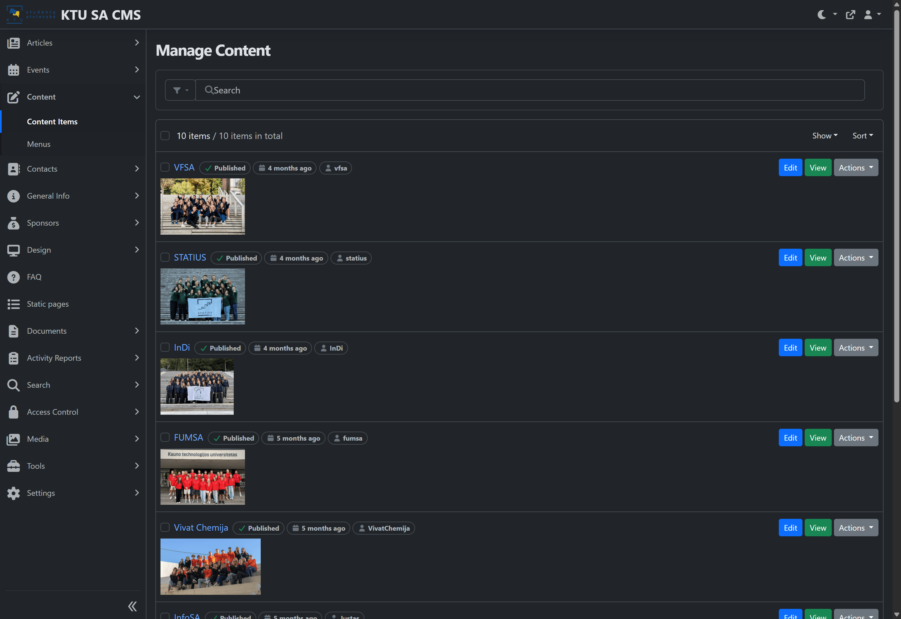

The ten SA units (CSA, InfoSA, Vivat Chemija, InDi, STATIUS, FUMSA, ESA, SHM, VFSA, BRK) are fixed. They are created by the system and **cannot be added or deleted** from the admin panel — only edited.

Under **General Info** each unit you have rights to gives you two entries:

- **All *unit* contacts** — the member list for that unit, filtered so you only see your own people.

  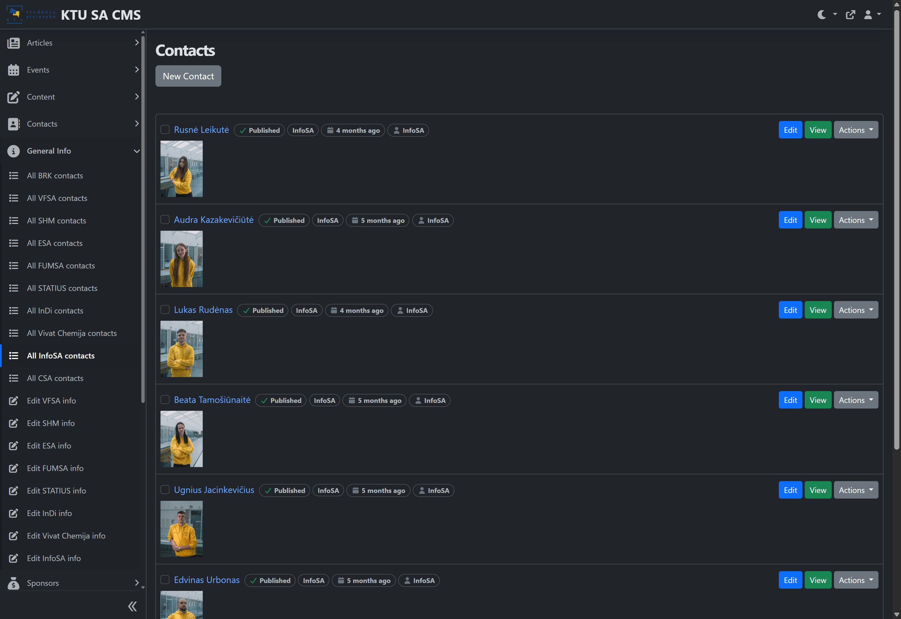

- **Edit *unit* info** — the unit's own page content.

CSA and BRK have a contacts list but no editable info page, by design.

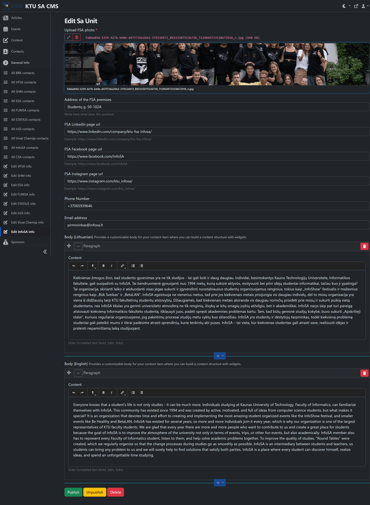

The unit info editor holds:

| Field | Notes |
| --- | --- |
| **Upload FSA photo** | Required. The unit's header image — a wide group photo works best |
| **Address of the FSA premises** | Where the unit sits, e.g. `Studentų g. 50-102A` |
| **FSA LinkedIn page url**, **FSA Facebook page url**, **FSA Instagram page url** | Optional. Each field shows an example beneath it. An empty one simply does not render an icon |
| **Phone Number**, **Email address** | The unit's public contact details |
| **Body (Lithuanian)** / **Body (English)** | The unit's description, built from widgets |

Paste social links as full addresses including `https://`, exactly as the example hint shows.

This editor has **Publish**, **Unpublish** and **Delete** but no **Save Draft** — unit info is not draftable, so anything you publish here is live at once. Copy the text somewhere safe before a large rewrite.

---

## 10. Sponsors

- **Menu:** Sponsors → All sponsors / Add new sponsor
- **Public page:** the sponsor strip on the home page

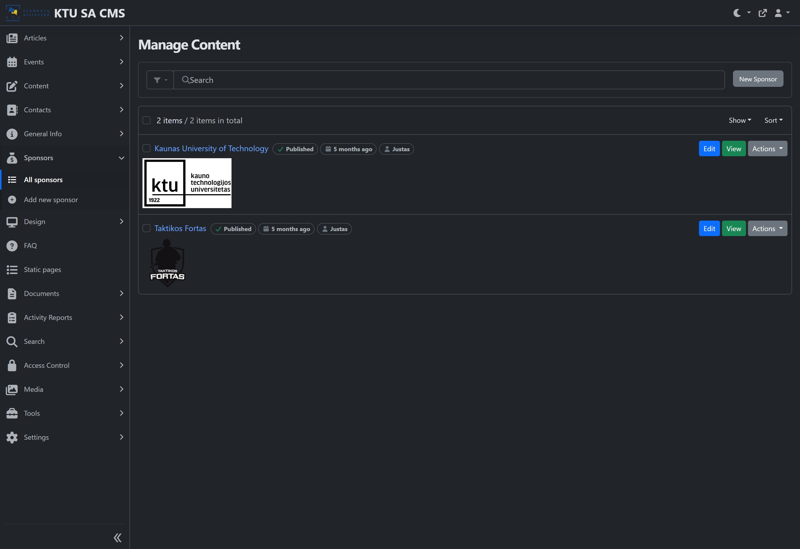

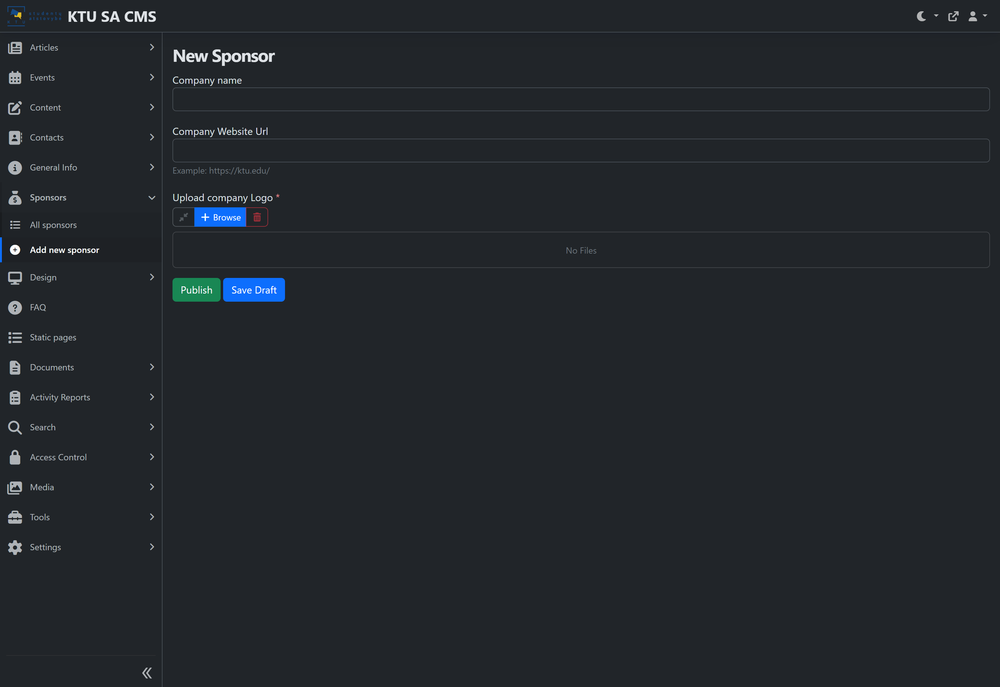

A sponsor has three fields:

- **Company name** — used as the tooltip on the logo
- **Company Website Url** — where clicking the logo goes. Include `https://`
- **Upload company Logo** — required. `.jpg` `.jpeg` `.png` `.webp` or `.svg`

The logos are displayed at a uniform height on a light background, so upload a logo with a transparent or white background and reasonable padding. SVG is preferred where the sponsor provides it.

Sponsors are draftable: unpublish a sponsor when a partnership ends rather than deleting it, so it is easy to bring back.

---

## 11. Static pages

- **Menu:** Static pages

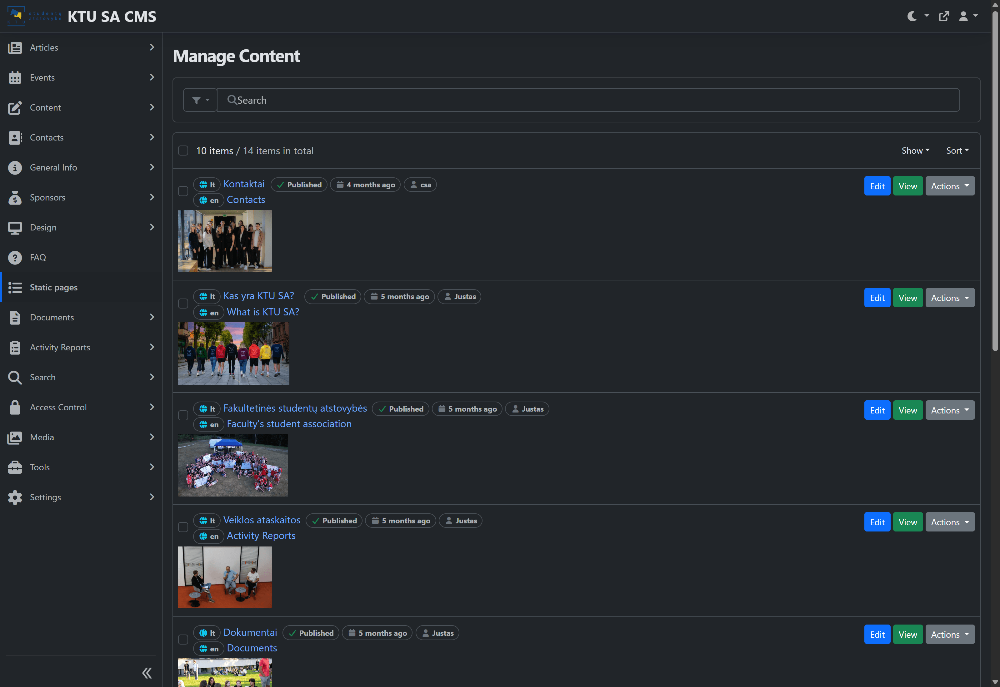

Static pages control the **hero block** — the title, the description and the background image — at the top of the fixed pages of the site: contacts, FAQ, events, articles, and so on. They also carry an optional body.

You edit these; you do not create them.

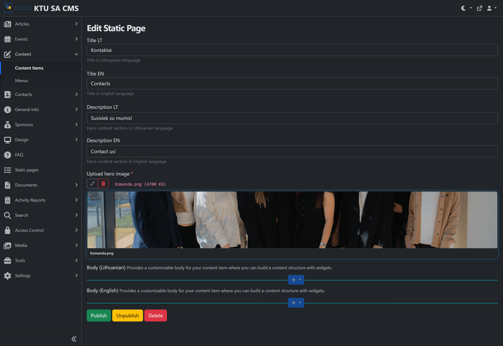

Each one has:

- **Title LT** / **Title EN** — the large heading, and the browser tab title
- **Description LT** / **Description EN** — the sentence under the heading, and the page's search engine description
- **Upload hero image** — the background image
- **Body (Lithuanian)** / **Body (English)** — optional extra content

Because the title and description feed the page's search-engine metadata, keep the description a readable full sentence rather than a list of keywords.

The item's name in the list is written as `Lithuanian title / English title` so you can identify the page you want.

Static pages are not draftable — **Publish** and **Unpublish** only. Anything you publish here changes the top of a live page immediately.

---

## 12. Activity reports

- **Menu:** Activity Reports → All activity reports / Create activity report

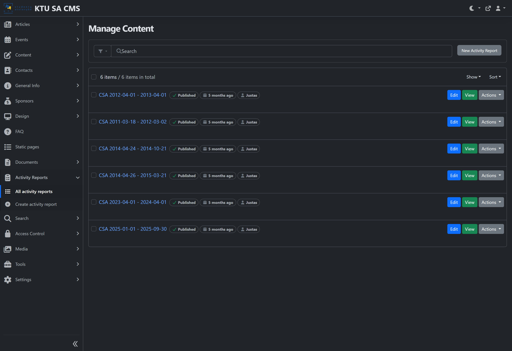

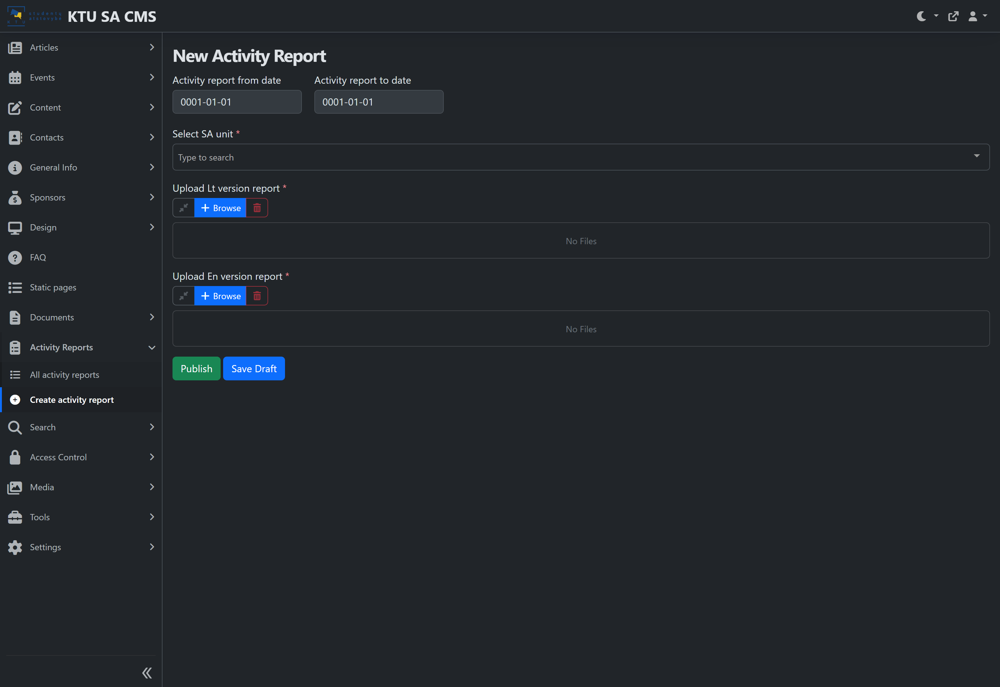

An activity report is a PDF covering a period for one unit:

- **Activity report from date** and **Activity report to date** — the period the report covers
- **Select SA unit** — which unit the report belongs to
- **Upload Lt version report** — `.pdf`
- **Upload En version report** — `.pdf`

The reports appear on the corresponding unit's page, grouped by period. Set the from and to dates accurately — they are what the site sorts and labels by, not the file name.

---

## 13. Media library

- **Menu:** Media

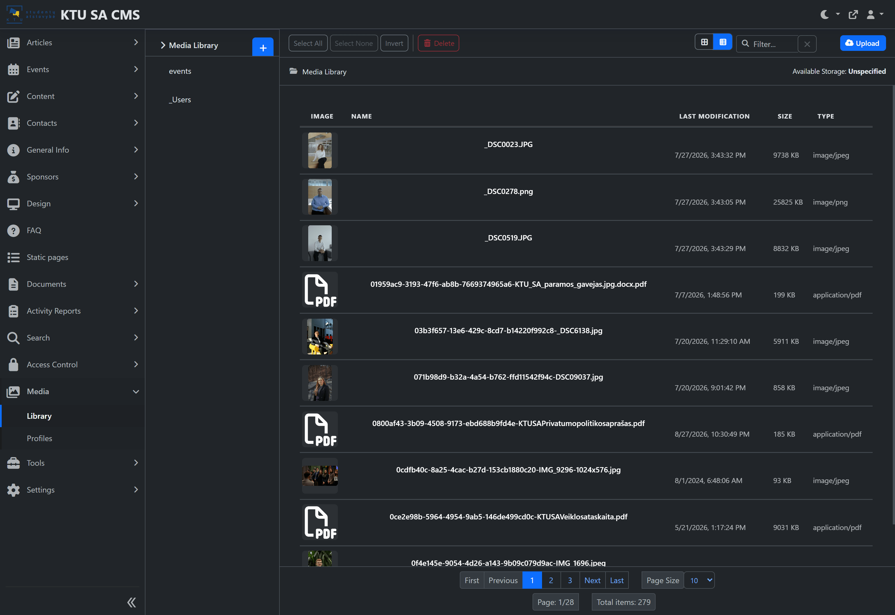

Every image and PDF used anywhere in the CMS lives here. You can reach it through the **+ Browse** button of any media field, or browse it directly from the menu.

The folder tree is on the left; the **+** beside **Media Library** creates a new folder. Upload into a sensible folder rather than the root — imported Fienta event images, for example, go into `events/`.

Across the top: **Select All / Select None / Invert** and **Delete** for bulk operations, a grid/list view toggle, a **Filter…** box that matches file names, and the blue **Upload** button. The footer has paging and a page-size selector; the library already holds several hundred files, so use the filter rather than scrolling.

Practical points:

- **Deleting a file here breaks every item that uses it.** The item keeps a reference to a file that no longer exists and the image renders as broken. Check before deleting.
- Uploading a file with an existing name in the same folder replaces it. That is a quick way to update a logo everywhere at once — and a quick way to change an image you did not mean to touch.
- Resize large photos before uploading. The library already contains images of 9 MB and 25 MB straight off a camera; those make the public page slow for everyone. Around 1600 px wide is plenty for a hero image.
- Give files meaningful names before uploading. `DSC_0042.jpg` is unfindable six months later.

---

## 14. Users, roles and permissions

- **Menu:** Access Control → Users / Roles
*Administrators and the President role only.*

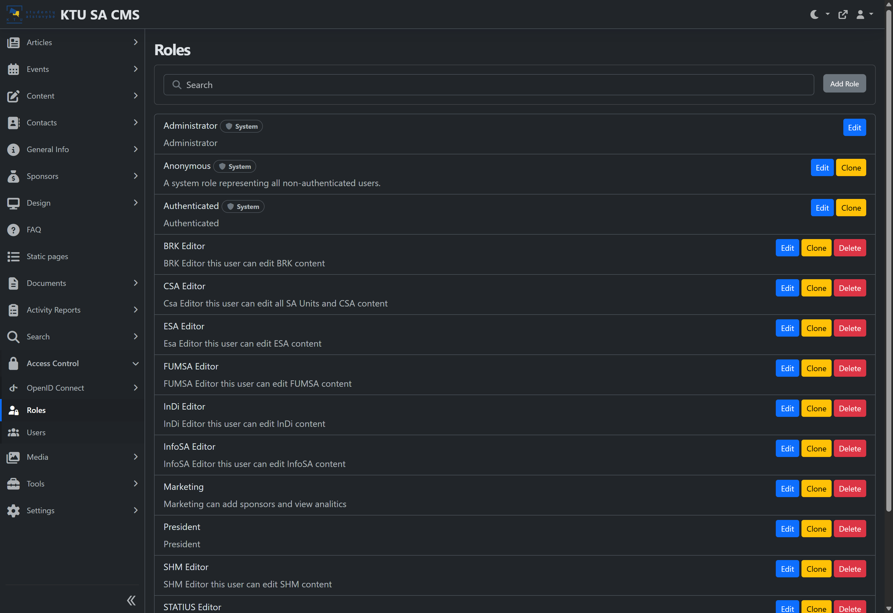

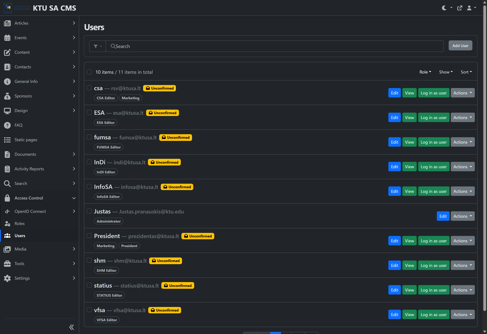

### The roles

The **Roles** page lists them with a one-line description each. **Administrator**, **Anonymous** and **Authenticated** are marked *System* and should be left alone; the rest are this project's own.

| Role | Scope |
| --- | --- |
| **Administrator** | Everything, including settings and the content model |
| **President** | All content, plus user management: create users, assign roles, manage positions |
| **CSA Editor** | All SA units and CSA content — effectively everything editorial |
| **Marketing** | Sponsors and analytics |
| ***Unit* Editor** (InfoSA, ESA, FUMSA, STATIUS, VFSA, SHM, InDi, VIVAT chemija, BRK) | Only that unit's events, contacts and unit info |

The unit editor roles are the reason the menu looks different for different people. An ESA editor can manage ESA events, ESA contacts and the ESA info page, and cannot see or change another unit's content. Articles, sponsors, documents, FAQ and static pages are shared and restricted to administrators, CSA editors and marketing.

### Adding a person

1. **Access Control → Users → Add User**
2. Fill in the username and email.
3. Tick exactly the roles they need — usually a single unit editor role.
4. Save. The account gets a password through the normal Orchard Core flow.

The user list filters by **Role** and by **All Users / Enabled Users / Disabled Users**, which is how you audit who still has access.

Give the narrowest role that lets someone do their job. When a person leaves, **disable** the account (Actions → Disable) rather than deleting it, so the history of what they edited stays intact.

**Log in as user**, shown on each row, impersonates that account. Use it to check what an editor can actually see when they report a missing menu — and log out of the impersonation when you are done.

---

## 15. Publishing checklist

Before pressing **Publish**, run through this:

- [ ] Both languages filled in — title, description and body
- [ ] Required images uploaded, in landscape where they are used as a hero
- [ ] Links start with `https://` and open the right page
- [ ] For events: start and end dates correct, **and at least one organiser selected**
- [ ] For contacts: **Order no.** set so the ordering makes sense
- [ ] For documents: both the Lt and the En PDF attached
- [ ] Text pasted from Word or Google Docs still reads correctly after the styling was stripped

After publishing, open the public site and check the page. The site caches content for up to an hour, so a change may take a little while to appear — that is normal and not a sign that publishing failed.

---

## 16. Troubleshooting

**A menu section I need is missing.**
Your role does not include it. Ask an administrator or the President to check your roles under **Access Control → Users**.

**The form will not save and a field is highlighted.**
A required field is empty. The usual culprits are a missing image, a missing second-language PDF, or an unselected SA unit / position. Scroll up through the whole form — the failing field is often in a collapsed section.

**I published but the website has not changed.**
Give it up to an hour: the public site caches API responses. If it is still wrong after that, check that the item is *Published* and not *Draft* in the list view.

**My event does not show on the unit page.**
**Select event organisers** is empty. Edit the event, pick the unit, and publish again.

**An image shows as broken on the site.**
The file was renamed or deleted in the media library after the item was created. Re-select the image in the item's media field.

**I imported from Fienta and my description was replaced.**
That is what the import does — it overwrites the fields it manages. Edit the description after importing, not before.

**I deleted something by mistake.**
Deletion is permanent from the admin panel; there is no undo for a single item. What exists is a whole-database restore under **Backup → Database backup**, which an administrator can run — but it rolls the entire site back to when that backup was taken, losing everything published since. Tell an administrator quickly, and stop publishing until it is decided. This is why **Unpublish** is the safe choice for content that might return.

---

## 17. Appendix — the public API

*For developers integrating with the CMS.* Interactive documentation is served by Scalar from the running application.

| Method | Route | Returns |
| --- | --- | --- |
| GET | `/api/articles` | Paged article previews |
| GET | `/api/articles/{id}` | One article with full content |
| GET | `/api/events` | Paged event previews; filterable by SA unit |
| GET | `/api/events/{id}` | One event with full content |
| GET | `/api/faqs` | Paged FAQ items; supports a search term |
| GET | `/api/documents` | Document categories with their documents |
| GET | `/api/sponsors` | Sponsors |
| GET | `/api/static-pages/{pageName}` | One static page's hero and body |
| GET | `/api/sa-units/{saUnit}` | One SA unit's info |
| GET | `/api/sa-units/{saUnit}/contacts` | That unit's members |
| GET | `/api/sa-units/{saUnit}/main-contact` | That unit's office contact |
| GET | `/api/sa-units/{saUnit}/activity-reports` | That unit's reports |

List endpoints accept `page` and `pageSize` query parameters and return an envelope:

```json
{
  "items": [],
  "page": 1,
  "pageSize": 9,
  "totalCount": 15,
  "totalPages": 2,
  "hasPreviousPage": false,
  "hasNextPage": true
}
```

`pageSize` is capped at 100. A `page` beyond the last page is clamped to the last page rather than returning an error, so a stale bookmark degrades gracefully.

Only published content is returned. Drafts are never exposed through the API.
